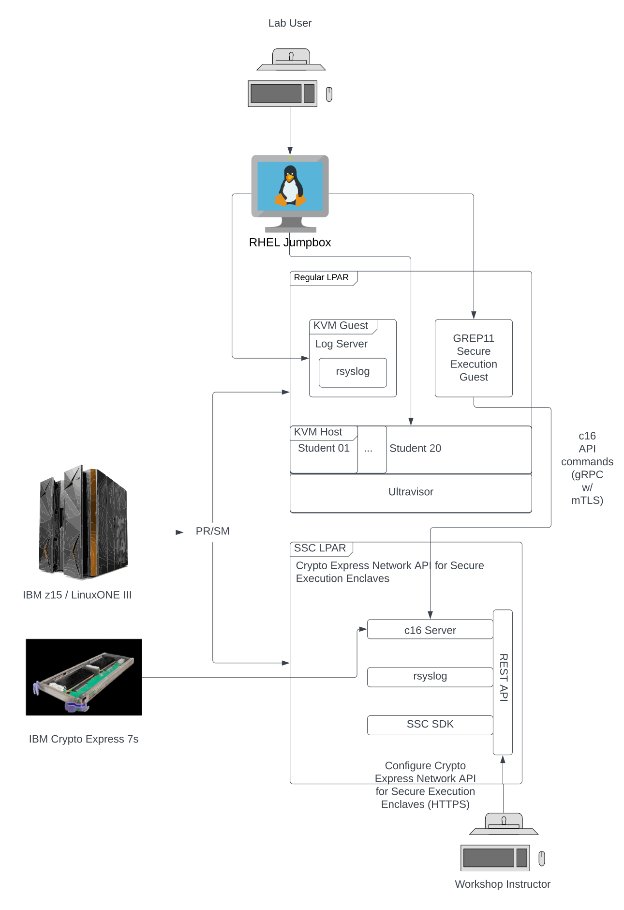

# Lab Overview

## Lab environment topology

<figure markdown>
  
  <figcaption>Confidential Computing Lab Architecture</figcaption>
</figure>

Hyper Protect Virtual Servers 2.1.3 provides an IBM-provided and -supported Secure Execution-enabled KVM image that runs on a Linux LPAR on an IBM zSystems or LinuxONE server. 

Hyper Protect Virtual Servers allows you to specify your workload via a "contract" that you define. 

Within the contract you specify an OCI-compliant image that provides your workload.

For our lab this LPAR is running RHEL 8.5.  You can use any distribution on IBM zSystems or LinuxONE that supports Secure Execution- i.e., recent versions of Ubuntu and SUSE as well as RHEL.

The Hyper Protect Virtual Servers 2.1.3 product provides a component, Crypto Express Network API for Secure Execution Enclaves (CENA4SEE) 1.1.1.2, that runs as an appliance in a Secure Service Container LPAR that has direct-attached Crypto Express cards.  CENA4SEE also provides a GREP11 Server OCI image that communicates with the CENA4SEE appliance. 

This enables GREP11 client code written to call the GREP11 Server API to  access the Crypto Express cards on the CENA4SEE SSC LPAR.
The GREP11 client code can run from anywhere as long as it has network connectivity to the GREP11 Server.  The GREP11 Server can run anywhere as long as it has network connectivity to the CENA4SEE server.

For our lab, The GREP11 client code will run in a KVM guest running Ubuntu 22.04 within our RHEL 8.5 Linux LPAR. Each student will start and use their own such guest.
The GREP11 server will run in the same RHEL 8.5 Linux LPAR, and it will be a Secure Execution-enabled HPVS 2.1.3 KVM guest.  (All HPVS 2.1.3 guests are by definition enabled for Secure Execution, so in the remainder of the lab we may not repeat the full phrase "Secure Execution-enabled HPVS 2.1.3 KVM guest", but we used it here for emphasis). Each student will start and use their own such GREP11 server guest. 

Your HPVS 2.1.3 GREP11 Server guest will be configured to write log messages to an _rsyslog_ service.  For the lab, you will configure this rsyslog service on the same Ubuntu guest that you are using for the GREP11 client code.

A single SSC LPAR is used for the CENA4SEE server. Each student's HPVS 2.1.3 GREP11 Server will communicate with the CENA4SEE server- therefore, the instructors have already set up this server for you.

During the lab you will log in to two servers: 

1. The RHEL 8.5 host.  From here you will launch your Ubuntu KVM guest. You will also use your host login to define the "contract" that HPVS expects so that you can launch your HPVS 2.1.3 GREP11 Server

2. You will log in to your Ubuntu KVM guest for configuring the rsyslog service and for running the GREP11 client code

You will not log in directly to your HPVS 2.1.3 GREP11 Server, nor to the CENA4SEE SSC LPAR, but you will make use of them via your GREP11 Client code.