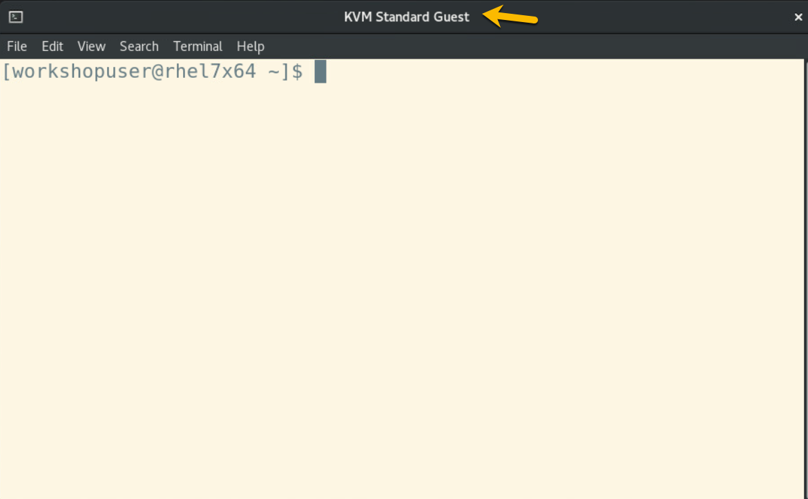

# Configure rsyslog service

You will be performing this section from your Ubuntu KVM guest, so switch back to your terminal session for your Ubuntu KVM guest. 

Your window or tab should like like this (unless you customized the profile we provided you):




## Overview of this page

The HPVS 2.1.5-protected KVM Guest for the PayNow Demo that you will create later in the lab will log its output to an rsyslog service on the Ubuntu KVM guest that you just started at the beginning of the lab. Rsyslog on your Ubuntu KVM guest is currently not set up for this, so you will configure rsyslog in this section of the lab.

!!! Note "Logging to IBM Log Analysis on IBM Cloud"
    You can also log the output of an HPVS 2.1.5 guest to an [IBM Log Analysis instance on IBM Cloud](https://cloud.ibm.com/catalog/services/logdna){target="_blank" rel="noopener"}.  That is not covered in this lab but if you are interested in this, it is covered in the [product documentation](https://www.ibm.com/docs/en/hpvs/2.1.x?topic=servers-logging-hyper-protect-virtual){target="_blank" rel="noopener"}.

## Install rsyslog-gnutls package

The initial installation of Ubuntu installed an _rsyslog_ service.  Display it with this command:

   ``` bash
   sudo systemctl status rsyslog
   ```

???- example "Example output"

      ```
      ● rsyslog.service - System Logging Service
           Loaded: loaded (/lib/systemd/system/rsyslog.service; enabled; vendor preset: enabled)
           Active: active (running) since Tue 2023-02-14 00:24:49 UTC; 12min ago
      TriggeredBy: ● syslog.socket
             Docs: man:rsyslogd(8)
                   man:rsyslog.conf(5)
                   https://www.rsyslog.com/doc/
         Main PID: 654 (rsyslogd)
            Tasks: 4 (limit: 2350)
           Memory: 2.2M
              CPU: 8ms
           CGroup: /system.slice/rsyslog.service
                   └─654 /usr/sbin/rsyslogd -n -iNONE

      Feb 14 00:24:49 ubuntu2204 systemd[1]: Starting System Logging Service...
      Feb 14 00:24:49 ubuntu2204 systemd[1]: Started System Logging Service.
      Feb 14 00:24:49 ubuntu2204 rsyslogd[654]: imuxsock: Acquired UNIX socket '/run/systemd/journal/syslog' (f>
      Feb 14 00:24:49 ubuntu2204 rsyslogd[654]: rsyslogd's groupid changed to 115
      Feb 14 00:24:49 ubuntu2204 rsyslogd[654]: rsyslogd's userid changed to 107
      Feb 14 00:24:49 ubuntu2204 rsyslogd[654]: [origin software="rsyslogd" swVersion="8.2112.0" x-pid="654" x->
      Feb 14 00:24:49 ubuntu2204 systemd[1]: rsyslog.service: Sent signal SIGHUP to main process 654 (rsyslogd)>
      Feb 14 00:34:49 ubuntu2204 rsyslogd[654]: [origin software="rsyslogd" swVersion="8.2112.0" x-pid="654" x->
      lines 1-22/22 (END)

      ```

If you're having trouble getting back to a command prompt, press _q_ (for _quit_). 

The default installation of rsyslog needs to be modified to allow it to receive messages sent across the network using the TCP protocol and with mutual TLS authentication.

You'll modify the configuration to allow this.  

1. Become the root user:

	``` bash
	sudo su -
	```

	???- example "Example output when becoming root"

		```
		student@ubuntu2204:~$ sudo su -
		root@ubuntu2204:~# 
		```

2. Create the proper configuration file in the */etc/rsyslog.d/* directory:

	``` {bash hl_lines="17-21 23-29"}
	cat << EOF > /etc/rsyslog.d/server.conf
	# output to journal
	module(load="omjournal")
	template(name="journal" type="list") {
	# can add other metadata here
	property(outname="PRIORITY" name="pri")
	property(outname="SYSLOG_FACILITY" name="syslogfacility")
	property(outname="SYSLOG_IDENTIFIER" name="app-name")
	property(outname="HOSTNAME" name="hostname")
	property(outname="MESSAGE"  name="msg")
	}

	ruleset(name="journal-output") {
	action(type="omjournal" template="journal")
	}

	# make gtls driver the default and set certificate files
	\$DefaultNetstreamDriver "gtls"
	\$DefaultNetstreamDriverCAFile /var/lib/rsyslog/x509/ca.crt
	\$DefaultNetstreamDriverCertFile /var/lib/rsyslog/x509/server.crt
	\$DefaultNetstreamDriverKeyFile /var/lib/rsyslog/x509/server-key.pem

	# load TCP listener
	module(
	load="imtcp"
	StreamDriver.Name="gtls"
	StreamDriver.Mode="1"
	StreamDriver.Authmode="x509/certvalid"
	)

	# start up listener at port 6514
	input(
	type="imtcp"
	port="6514"
	ruleset="journal-output"
	)

	EOF
	```

	We might have had you put the cart before the horse a little bit because there is some work to do to ensure that what you've added to this configuration file actually works! But we did this so that we can point out the sections that are requiring this extra work.

	!!! Tip "Take a look close to the bottom of the file"

		There are two sections of interest that are highlighted in the above code block. If these lines could speak to you, they would say, "We are going to receive TCP messages, and we will use TLS to authenticate with the sender of these messages and to enable encryption of the messages, and here are the certificate and keys needed to enable this to work".

	For this configuration file to work, you'll need to install a software package to allow rsyslog to receive TLS-authenticated TCP messages and you'll need to create the certificate and keys and put them where the configuration file says you put them.

3. Prove to yourself that the _rsyslog_ package has already been installed (by the "bare-bones" default Ubuntu setup):

	``` bash
	apt-cache policy rsyslog
	```

	???- example "Output showing rsyslog is already installed"

		``` bash
		rsyslog:
			Installed: 8.2112.0-2ubuntu2.2
			Candidate: 8.2112.0-2ubuntu2.2
			Version table:
		*** 8.2112.0-2ubuntu2.2 500
				500 http://ports.ubuntu.com/ubuntu-ports jammy-updates/main s390x Packages
				500 http://ports.ubuntu.com/ubuntu-ports jammy-security/main s390x Packages
				100 /var/lib/dpkg/status
			8.2112.0-2ubuntu2 500
				500 http://ports.ubuntu.com/ubuntu-ports jammy/main s390x Packages
		```

4. Prove to yourself that the _rsyslog-gnutls_ package has not been installed yet:

	``` bash
	apt-cache policy rsyslog-gnutls
	```

	???- example "Output showing rsyslog-gnutls is not installed"

		```
		rsyslog-gnutls:
			Installed: (none)
			Candidate: 8.2112.0-2ubuntu2.2
			Version table:
			8.2112.0-2ubuntu2.2 500
				500 http://ports.ubuntu.com/ubuntu-ports jammy-updates/main s390x Packages
				500 http://ports.ubuntu.com/ubuntu-ports jammy-security/main s390x Packages
			8.2112.0-2ubuntu2 500
				500 http://ports.ubuntu.com/ubuntu-ports jammy/main s390x Packages
		```

5. Remedy the situation (not having _rsyslog-gnutls_ package installed):

	``` bash
	apt-get install rsyslog-gnutls
	```

	???- example "Output from installing rsyslog-gnutls"

		```
		Reading package lists... Done
		Building dependency tree... Done
		Reading state information... Done
		Suggested packages:
			gnutls-bin
		The following NEW packages will be installed:
			rsyslog-gnutls
		0 upgraded, 1 newly installed, 0 to remove and 0 not upgraded.
		Need to get 17.8 kB of archives.
		After this operation, 90.1 kB of additional disk space will be used.
		Get:1 http://ports.ubuntu.com/ubuntu-ports jammy-updates/main s390x rsyslog-gnutls s390x 8.2112.0-2ubuntu2.2 [17.8 kB]
		Fetched 17.8 kB in 0s (71.9 kB/s)         
		Selecting previously unselected package rsyslog-gnutls.
		(Reading database ... 56568 files and directories currently installed.)
		Preparing to unpack .../rsyslog-gnutls_8.2112.0-2ubuntu2.2_s390x.deb ...
		Unpacking rsyslog-gnutls (8.2112.0-2ubuntu2.2) ...
		Setting up rsyslog-gnutls (8.2112.0-2ubuntu2.2) ...
		Scanning processes...                                                                                     
		Scanning linux images...                                                                                  

		Running kernel seems to be up-to-date (ABI upgrades are not detected).

		No services need to be restarted.

		No containers need to be restarted.

		No user sessions are running outdated binaries.

		No VM guests are running outdated hypervisor (qemu) binaries on this host.
		```

6. _Optional_: Repeat `apt-cache policy rsyslog-gnutls` to see that the package is now installed:

	``` bash
	apt-cache policy rsyslog-gnutls
	```

	???- example "Output showing that rsyslog-gnutls is installed"

		```
		rsyslog-gnutls:
			Installed: 8.2112.0-2ubuntu2.2
			Candidate: 8.2112.0-2ubuntu2.2
			Version table:
		*** 8.2112.0-2ubuntu2.2 500
				500 http://ports.ubuntu.com/ubuntu-ports jammy-updates/main s390x Packages
				500 http://ports.ubuntu.com/ubuntu-ports jammy-security/main s390x Packages
				100 /var/lib/dpkg/status
			8.2112.0-2ubuntu2 500
				500 http://ports.ubuntu.com/ubuntu-ports jammy/main s390x Packages
		```

## Create a Certification Authority (CA) for your rsyslog service

### Background Information

The TLS authentication for communication with the rsyslog service requires an X509 certificate and private key.  An X509 certificate contains a public key that goes with the private key.  An X509 certificate also contains metadata including the identification of the holder of the certificate, the purposes the certificate is intended for, and more. Think of a public key as a yummy cake baked with yellow dough, it's moist and tastes pretty good- but the X509 certificate wrapped around it is like the chocolate icing and the rainbow sprinkles- it's delicious!  (Break time!!) If you haven't given up on the analogy, think of the private key as the secret recipe to bake the cake that nobody but you knows about.  For a slightly more technical (but still just scratching the surface), but perhaps not as tasty, description of public key cryptography check out this [description from one of our earlier labs](https://ibm-wsc.github.io/hyper-protect-virtual-servers-workshop/grep11-lab/lab-exercise3/#public-key-cryptography-in-simple-terms){target="_blank" rel="noopener"}.

An X509 certificate needs to be created and signed by a certification authority (CA). 

!!! Info "The authority prefers certification"

    Most people call a CA a "certificate authority" but actually the Internet Request for Comment (RFC) that defines the X509 standard uses the term ["_certification_ authority"](https://www.rfc-editor.org/rfc/rfc5280#section-3){target="_blank" rel="noopener"}. Imagine that! :smile:

For the lab you will create your own CA- what is often called a "self-signed" CA. A utility called `openssl` can be used to do this.  A CA signs certificates that it creates. In order to digitally sign something, you use a private key.  In simple terms, a publicly known algorithm- which can be poked at and prodded at by researchers and academics in an effort to prove its security or to hopefully win a large bounty by proving its insecurity- is run against a private key that nobody else knows, and produces a unique output, or signature.  This signature can be verified algorithmically by anybody who holds the private key's corresponding public key.

???- Question "Who holds the public key?"

	That's right, the public :astonished:! It is safe to share your public key with others- it is your private key that you must protect from loss, theft or exposure.
	
If you receive a piece of digital information that is signed, and the public key that corresponds to the private key used to create the signature, you can prove that whoever signed this had to have held the private key in order to create the signature.  Okay, cool.  But what if a malicious actor had the private key and gave you the public key? Would you feel so great knowing you verified the signer if they were malicious?  No!  That is where a CA comes in. The idea is that the following process occurs:

1. An individual or organization submits a request for a certificate (CSR) with their public key.
2. The CA takes the effort to verify that the owner of the public key is a good actor and is who they say they are and can be trusted.
3. The CA creates the certificate that holds the public key, essentially stating "I am a CA and you can trust me when I say that the holder of this certificate that I just signed is a good person and they are who they say they are, so you can trust this certificate and anything it signs".

??? Question "How is that working out for us?"

	The X509 Certification Authority protocol is outstanding in theory. In practice its vulnerability lies in the need for the holders of private keys to protect them with diligence.  Losing your private key is akin to losing your wallet or your house key or your drivers license or ... you get the picture.  Attacks such as [software supply chain attacks](https://www.google.com/search?q=software+supply+chain+attacks){target="_blank" rel="noopener"} are often accomplished by malicious actors who have stolen others' private keys.  This is why initiatives like Confidential Computing and technologies like Hardware Security Modules are important.

In real world practice, for external, customer-facing applications an enterprise will ask a well-known and trusted third-party CA to issue its certificates. In many cases an enterprise may run its own internal CA for certificates for internal applications.   In this lab you're going to create your own CAs.  Hopefully, you trust yourself :fingers_crossed: enough to feel comfortable with this...

### Hands on keyboard time

1. Get out of root for the moment, as you'll be doing this certificate work with your regular authority:

	``` bash
	exit
	```

	???- example "Output when getting out of root"

		```
		root@ubuntu2204:~# exit
		logout
		```

	Your prompt should now end with a dollar sign ($) indicating you are operating with your regular authority as userid _student_, as opposed to the hash sign (#) prompt that you had when you were operating with _root_ authority.  

2. Run this command sequence:

	``` bash
	cd ${HOME} && mkdir -p rsyslogWork && cd rsyslogWork
	```
	
	It accomplishes the following:

	1. Ensures you are in your home directory (which you already are in unless you wandered off on your own)
	2. Creates a fresh directory that you'll work in for this activity
	3. Switches to this new directory

3. Create a private key. It will be the private key your self-signed CA will use so call it `ca-key.pem`:

	``` bash
	openssl genrsa -out ca-key.pem 4096
	```


4.  Run the following command to create a configuration file for your CA

	``` bash
	cat << EOF > ca.cnf
	[ req ]
	default_bits = 2048
	default_md = sha256
	prompt = no
	encrypt_key = no
	distinguished_name = dn

	[ dn ]
	C = US
	O = IBM WSC IBM Z and LinuxONE
	CN = CA for rsyslog for SE-enabled KVM guests

	EOF
	```

	!!! Question "Why are we using .cnf configuration files?"
		
		Some `openssl` commands have a tendency to ask a bunch of questions which can be tedious and error-prone when typing the answers, but you can avoid that by creating a configuration file that provides the answers and thus avoids the questions.  You'll see this pattern throughout the lab.

5. A CA itself has a certificate that it can send or make available to others (others being people, or computer processes, or whomever). You don't have one yet- all you have is a private key. A certificate signing request (CSR) can be created from a private key- it derives the public key from the private key and creates an object called a Certificate Signing Request (CSR) that contains the public key and other identifying information and can be sent to a CA. Create your CSR:

	``` bash
	openssl req -config ca.cnf -key ca-key.pem -new -out ca-req.csr
	```

	!!! Info "Certificate Signing Request (CSR)"

		The RSA algorithm is a magical mystery tour to most mortals, but the algorithm is such that the public key can be extracted from a private key. You will use the private key as input to a command that will create what is known as a CSR. A CSR is a file that contains the public key (the yellow dough) and other information (the icing and the sprinkles) that you then send to the CA and say "please, please, I'm a good person and you can trust me and please create a real certificate for me".  A CSR is like a caterpillar :bug: and the resulting certificate is like a beautiful butterfly :butterfly:.

	Now you have a certificate signing request. 

	So you normally send a CSR to a CA to sign.  There's a "chicken or the egg" problem here.  If a CA needs a Certificate,  and a Certificate has to be created by another CA, then how did that CA get created?  By another CA?  Yes, possibly.  But, does the chain go on forever?  No-  at some point in the chain the CA's certificate was signed by its own private key, and not a higher CA.  This is the root of the chain, and it is self-signed. In real life, a chain could be many layers deep, but it eventually has to stop.  Think of it like a management chain in an organization's org chart-  there are first-line managers, second-line managers, and so forth up to the CEO.  The Root certificate is like the CEO.  

6. Since you're the boss of your lab, and the worker, you don't need a big long chain of CA's.  Just one will do fine.  So you'll build a single root, or self-signed, CA, and you'll like it!  :wink::

	``` bash
	openssl x509 -signkey ca-key.pem -in ca-req.csr -req -days 365 -out ca.crt
	```

	???- example "Output from creating self-signed CA certificate"

		```
		Certificate request self-signature ok
		subject=C = US, O = IBM WSC IBM Z and LinuxONE, CN = CA for rsyslog for SE-enabled KVM guests
		```

## Create certificate and key for your rsyslog service

### Process Overview

In real life, a CA will probably issue lots of certificates- it's how they make money.  Your CA is only going to create a couple:

 - a certificate for the rsyslog service which you will create next.
 - a certificate for the client (your future HPVS KVM guest for the PayNow demo) of the rsyslog service, which you will create later in the lab.  

The process is the same as what you just went through for creating your CA for steps 1-3 below but differs slightly for step 4:

1. Create a private key
2. Create a configuration file to answer questions ahead of time
3. Use the key and the config file to create a CSR
4. This time you'll have your "self-signed" CA create and sign the certificate.  

### Creation time

1. Create the private key:

	``` bash
	openssl genrsa -out server-key.pem 4096
	```
   
2. Create the configuration file to preemptively answer the inevitable questions.  We've used a command pipe to extract your guest's IP address into a variable and then we use that variable in two places in the configuration file.  If you borrow this technique for your system please ensure that this command pipe works on your system:

	``` bash
	export ip="$(ip route get 1.1.1.1 | grep -oP 'src \K[^ ]+')" && \
	cat << EOF > server.cnf
	[ req ]
	default_bits = 2048
	default_md = sha256
	prompt = no
	encrypt_key = no
	distinguished_name = dn

	[ server ]
	subjectAltName = IP:${ip}
	extendedKeyUsage = serverAuth

	[ dn ]
	C = US
	O = Rsyslog Service
	CN = ${ip}
	EOF
	```

      *Optional*: You know you can't resist looking at the output file to see if that IP magic worked, so just do it:

      ``` bash
      cat server.cnf
      ```

3. Create the rsyslog service's CSR:

	``` bash
	openssl req -config server.cnf -key server-key.pem -new -out server-req.csr
	```

4. "Send" the request to your "self-signed" CA in order to create the certificate:

	``` bash
	openssl x509 -req -in server-req.csr -days 365 -CA ca.crt -CAkey ca-key.pem -CAcreateserial -extfile server.cnf -extensions server -out server.crt
	```

	???- example "Example output from certificate creation"

		```
		Certificate request self-signature ok
		subject=C = US, O = Rsyslog Test Server, CN = 172.16.0.42
		```

	5. Run this command to display the rsyslog service's certificate in a form that a human can comprehend:

		``` bash
		openssl x509 -noout -text -in server.crt 
		```

		???- example "Example human-readable display of certificate"

			``` x509
			Certificate:
				Data:
					Version: 3 (0x2)
					Serial Number:
						72:1b:54:77:9d:c9:28:b0:7c:f0:b8:d6:dc:24:e1:b1:60:fa:59:f7
					Signature Algorithm: sha256WithRSAEncryption
					Issuer: C = US, O = IBM WSC IBM Z and LinuxONE, CN = CA for rsyslog for SE-enabled KVM guests
					Validity
						Not Before: Feb 14 01:18:18 2023 GMT
						Not After : Feb 14 01:18:18 2024 GMT
					Subject: C = US, O = Rsyslog Test Server, CN = 172.16.0.42
					Subject Public Key Info:
						Public Key Algorithm: rsaEncryption
							Public-Key: (4096 bit)
							Modulus:
								00:aa:ed:d0:83:3c:65:8c:6c:4d:f5:bc:bc:56:e9:
								3c:57:ab:b8:3c:29:14:2a:73:d6:ca:a0:7e:0c:00:
								fc:4f:cc:28:88:1c:01:e9:26:9e:5e:0b:60:5e:ee:
								69:f3:c7:c8:f9:26:19:71:a7:1a:c1:54:3a:3d:6b:
								01:4a:e2:20:ab:89:a5:31:a7:f4:a2:39:71:30:21:
								29:17:4f:04:15:73:1d:b7:b6:c2:81:c2:f1:d9:a8:
								29:d8:ca:c9:d6:97:f3:37:8e:17:9d:a7:b1:30:c8:
								5c:1c:be:e2:75:5e:9f:88:08:76:54:5a:ee:40:d4:
								90:26:2b:74:35:71:a2:d1:4d:86:db:46:bf:18:38:
								0a:fb:e4:1a:ab:ef:f6:49:1e:7b:bc:76:71:3a:b7:
								5e:e8:c0:c7:3d:db:74:2d:87:20:5b:e6:5e:27:67:
								1a:e9:e1:ea:20:b8:d2:fc:5e:2d:79:c0:e5:46:22:
								cf:6e:26:54:c6:00:d1:d0:05:46:0b:9d:97:8c:cb:
								68:e7:a4:b2:9a:47:21:67:e5:56:32:cb:ba:c3:0e:
								c8:f3:f4:17:02:ca:ee:ac:37:0e:f3:40:cf:a4:56:
								98:9d:b3:e3:e2:c2:43:d7:3b:a5:c1:09:92:2b:e9:
								fb:5b:a6:73:d0:83:97:c9:70:7f:f8:84:59:b3:b6:
								4f:e8:40:98:92:74:5c:8c:9f:db:27:7f:94:4b:00:
								a6:cf:06:9b:0f:a9:f4:35:17:01:e6:d6:6d:c2:78:
								f8:41:59:f6:f6:f2:11:d1:52:28:b5:06:78:ba:db:
								12:f2:3f:c6:ef:14:64:cd:85:49:ce:8e:fc:91:b8:
								2a:c3:25:6a:cc:3c:46:9d:e8:10:aa:30:fd:3b:55:
								3a:26:97:00:8b:62:c4:d6:89:f0:36:68:13:63:19:
								ba:18:f4:0c:4f:bc:5d:34:c8:24:d9:8e:2f:4b:e5:
								d9:dd:9f:39:8d:00:54:fe:d9:00:d7:f1:71:6b:8b:
								9c:ed:66:de:6a:26:3f:48:cb:3a:4a:fc:9c:50:12:
								f5:da:dc:e7:e5:08:6c:0a:6d:60:73:cf:e6:b2:3e:
								06:59:98:00:2c:97:25:38:01:50:2e:c2:c6:35:fa:
								e4:d5:20:01:fb:9d:ca:4c:78:3f:7a:ad:c7:5d:db:
								5e:04:c7:0f:e2:9f:a1:e9:27:f8:f2:a9:9f:00:07:
								58:68:c9:3f:d6:41:5b:46:90:f5:26:6a:04:2c:cf:
								44:c9:f8:1e:5d:38:95:95:71:e2:30:57:d5:83:41:
								73:a4:00:88:6b:99:84:71:d3:60:ce:32:9c:bb:3b:
								39:46:a7:77:fd:7e:ed:1c:81:02:e3:da:83:85:2c:
								c9:60:c7
							Exponent: 65537 (0x10001)
					X509v3 extensions:
						X509v3 Subject Alternative Name: 
							IP Address:172.16.0.42
						X509v3 Extended Key Usage: 
							TLS Web Server Authentication
						X509v3 Subject Key Identifier: 
							CC:01:AD:BA:8C:5F:31:B9:58:A9:2D:4E:05:C7:B1:B7:82:10:90:05
						X509v3 Authority Key Identifier: 
							DirName:/C=US/O=IBM WSC IBM Z and LinuxONE/CN=CA for rsyslog for SE-enabled KVM guests
							serial:0B:4A:84:C6:84:00:F8:7F:B7:0A:F0:82:FD:4E:C1:F2:99:C2:63:BC
				Signature Algorithm: sha256WithRSAEncryption
				Signature Value:
					4c:a3:7a:76:21:0d:8f:db:e9:3a:a6:3f:6b:3a:9a:5d:bb:ac:
					7e:75:5c:ed:69:3c:b9:2b:6e:84:1c:fc:1f:56:47:ff:b3:38:
					92:fe:0f:5b:2c:87:32:0e:8f:60:c3:33:ff:d5:89:26:61:9a:
					7f:ce:ae:f3:6b:cc:77:1b:4d:d0:59:5f:d9:09:e1:fa:21:5c:
					6a:6f:b3:71:45:10:98:4f:6e:fe:08:7f:31:42:e6:dd:83:9a:
					11:de:2d:eb:b5:b9:40:4d:80:86:7f:f8:88:cc:87:60:38:d4:
					e2:9a:89:9d:ec:43:61:ad:34:96:38:93:ca:4a:63:8d:cc:b7:
					33:98:33:e2:63:c1:7b:04:98:80:b3:e1:54:df:f6:24:57:82:
					98:c4:e8:64:8a:3b:d2:af:65:56:d7:97:c0:c3:dc:45:06:c9:
					4f:ce:5b:d3:49:7f:2b:28:83:27:57:b9:bf:1a:46:81:68:4c:
					6b:85:d7:db:f0:d4:25:7b:3d:92:63:d0:91:b5:ec:df:cb:e4:
					6b:6c:b0:c4:47:3c:c6:91:64:33:f6:11:6b:5b:f7:70:bd:e1:
					71:ef:a6:28:57:b2:a0:e0:2e:ef:ab:34:7a:c4:b8:24:18:88:
					5f:92:0b:92:ca:14:a2:b6:62:ab:2c:e6:c2:bb:27:91:54:de:
					84:56:1e:ed:f3:7d:b7:e8:34:b4:78:76:2c:1f:af:d9:61:b7:
					6e:59:fa:e8:33:38:b4:5e:30:69:71:06:4d:df:fe:cb:46:03:
					ba:69:7c:85:3c:f0:73:f7:d8:4e:b0:39:aa:79:72:1f:52:2e:
					05:cb:81:9f:e3:62:6b:66:55:7c:92:13:21:62:dc:fd:9d:8f:
					f8:77:dd:d2:b6:61:c4:8f:fa:fa:a0:74:95:fa:9d:f2:5d:d2:
					7d:d4:41:95:d8:41:50:99:7d:80:3d:36:28:75:28:62:67:05:
					11:a3:95:c7:85:8f:20:37:d6:b8:b5:8a:f6:8a:e3:d0:85:6e:
					cd:2a:41:f9:e7:48:bb:b0:b7:54:dc:6b:df:c9:a2:5e:f7:61:
					c2:3a:4c:82:7e:6b:e9:82:cf:c6:3a:7f:a2:ae:39:00:d9:ac:
					bf:8a:84:72:e6:ae:c1:75:e0:92:60:5e:cd:4b:64:1f:5a:44:
					3a:09:15:2c:95:b8:c3:ca:44:ec:79:1e:d5:96:bc:20:9a:7a:
					cf:6b:e4:cf:e0:91:f2:c2:e6:fd:f1:8a:66:c4:ae:eb:90:90:
					f4:ec:64:66:9a:9a:11:8d:11:ab:ef:05:d2:42:fb:e5:2c:78:
					8a:db:16:b7:96:ae:06:b8:42:b4:c7:23:26:b2:9a:c2:85:d8:
					6b:6d:d8:4e:84:0e:ab:a1
			```

## Copy certificates and private key to the location specified in the /etc/rsyslog.d/server.conf file

The configuration file you created in rsyslog a little while ago (near the top of this page) specified `/var/lib/rsyslog/x509` as the directory to hold some files. You just created these files in your _rsyslogWork_ directory, so now create the _/var/lib/rsyslog/x509_ directory and copy the files in there:

   ``` bash
   sudo mkdir -p /var/lib/rsyslog/x509 && \
   for file in ca.crt server.crt server-key.pem ; do \
     sudo cp -ipv ${file} /var/lib/rsyslog/x509/. ; \
   done \
   && sudo chown -R syslog:syslog /var/lib/rsyslog
   ```

???- example "Output from copying files"

      ```
      'ca.crt' -> '/var/lib/rsyslog/x509/./ca.crt'
      'server.crt' -> '/var/lib/rsyslog/x509/./server.crt'
      'server-key.pem' -> '/var/lib/rsyslog/x509/./server-key.pem'
      ```

## Restart your rsyslog service

You'll truly know that you configured everything correctly later in the lab when you try to write messages to it from your yet-to-be-created HPVS KVM guest for the PayNow demo. But for now, you will verify it somewhat by taking a before and after snapshot of which TCP ports on your system are listening.  

Run this command, and then in a moment you'll repeat the command.  What you should notice here is the absence of port 6514 in the output:

   ``` bash
   sudo lsof -nP -iTCP -sTCP:LISTEN
   ```

???- example "Output showing listening TCP ports"

      ```
      COMMAND   PID            USER   FD   TYPE DEVICE SIZE/OFF NODE NAME
      systemd-r 602 systemd-resolve   14u  IPv4  15472      0t0  TCP 127.0.0.53:53 (LISTEN)
      sshd      709            root    3u  IPv4  16871      0t0  TCP *:22 (LISTEN)
      sshd      709            root    4u  IPv6  16882      0t0  TCP *:22 (LISTEN)
      ```

You are now ready to restart the rsyslog service on your machine:

   ``` bash
   sudo systemctl restart rsyslog
   ``` 

No news is good news on the above command- it's pretty quiet when it works.

Display the rsyslog service's status and notice it hasn't been active very long, since it was just restarted:

   ``` bash
   sudo systemctl status rsyslog
   ```

*Reminder*:  *q* gets you back to a command prompt.

???- example "Output showing rsyslog status after restart"

      ```
      ● rsyslog.service - System Logging Service
           Loaded: loaded (/lib/systemd/system/rsyslog.service; enabled; vendor preset: enabled)
           Active: active (running) since Tue 2023-02-14 01:30:47 UTC; 13s ago
      TriggeredBy: ● syslog.socket
             Docs: man:rsyslogd(8)
                   man:rsyslog.conf(5)
                   https://www.rsyslog.com/doc/
         Main PID: 1439 (rsyslogd)
            Tasks: 9 (limit: 2350)
           Memory: 1.8M
              CPU: 1.008s
           CGroup: /system.slice/rsyslog.service
                   └─1439 /usr/sbin/rsyslogd -n -iNONE

      Feb 14 01:30:46 ubuntu2204 systemd[1]: Starting System Logging Service...
      Feb 14 01:30:47 ubuntu2204 rsyslogd[1439]: imuxsock: Acquired UNIX socket '/run/systemd/journal/syslog' (>
      Feb 14 01:30:47 ubuntu2204 rsyslogd[1439]: rsyslogd's groupid changed to 115
      Feb 14 01:30:47 ubuntu2204 rsyslogd[1439]: rsyslogd's userid changed to 107
      Feb 14 01:30:47 ubuntu2204 rsyslogd[1439]: [origin software="rsyslogd" swVersion="8.2112.0" x-pid="1439" >
      Feb 14 01:30:47 ubuntu2204 systemd[1]: Started System Logging Service.
      ```

Now when you rerun the command to see the listening TCP ports, seeing 6514 in the output is an indication of success.  If you don't see 6514 in the output, it's time to make those instructors earn their keep:

   ``` bash
   sudo lsof -nP -iTCP -sTCP:LISTEN
   ```
   
???- example "Expected output showing port 6514 is listening"

      ```
      COMMAND    PID            USER   FD   TYPE DEVICE SIZE/OFF NODE NAME
      systemd-r  602 systemd-resolve   14u  IPv4  15472      0t0  TCP 127.0.0.53:53 (LISTEN)
      sshd       709            root    3u  IPv4  16871      0t0  TCP *:22 (LISTEN)
      sshd       709            root    4u  IPv6  16882      0t0  TCP *:22 (LISTEN)
      rsyslogd  1439          syslog    6u  IPv4  22401      0t0  TCP *:6514 (LISTEN)
      rsyslogd  1439          syslog    7u  IPv6  22402      0t0  TCP *:6514 (LISTEN)
      ```

**Switch to your terminal tab or window for your session with the RHEL host, as you will start the next section of the lab working on the RHEL host.**

Please proceed to the next section of the lab by clicking the _Next_ link on the bottom right of this page.

