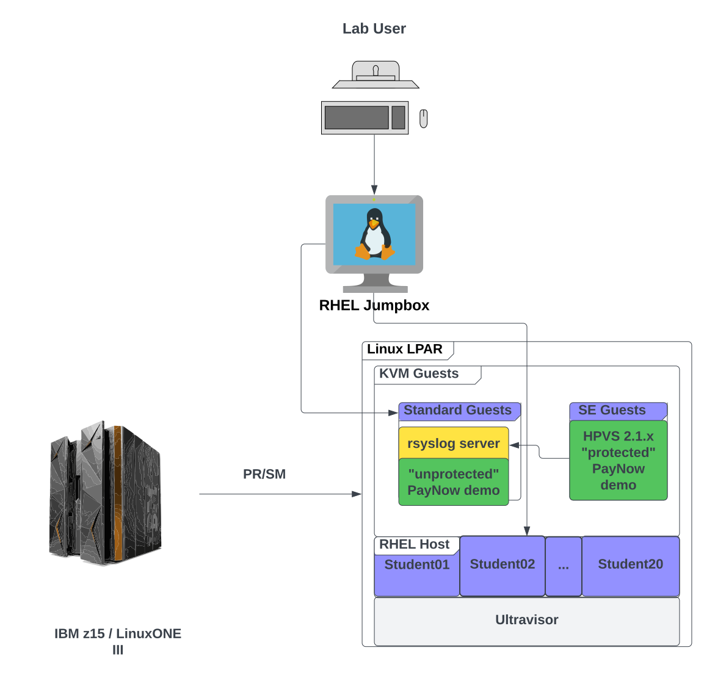

# Lab Overview

## Lab environment topology

<figure markdown>
  
  <figcaption>PayNow Demo Lab Architecture</figcaption>
</figure>

Hyper Protect Virtual Servers 2.1.4 provides an IBM-provided and -supported Secure Execution-enabled KVM image that runs on a Linux LPAR on an IBM Z or LinuxONE server. 

Hyper Protect Virtual Servers (HPVS) requires you to specify your workload via a "contract" that you define. 

Within the contract you specify an OCI-compliant image that provides your workload.

For our lab this LPAR is running RHEL 8.5.  You can use any distribution on IBM Z or LinuxONE that supports Secure Execution- i.e., recent versions of Ubuntu and SUSE as well as RHEL.

In the lab, you will run the a demonstration application called the *PayNow Demo* in two places-  you will run it once in a standard KVM guest, and you will run it once in an HPVS KVM guest protected by Secure Execution.

You will access both instances of the PayNow demo from a web browser and enter data representing sensitive information such as name, credit card number, credit card security code, etc.  This should be fictitious data that you make up for learning purposes in the lab.

From each instance of PayNow you will take a memory dump of the KVM guest and by following the lab instructions you will see that an insider attack from a malicious system administrator could extract sensitve data from the standard KVM guest, and then you will see that this insider attack fails when attempted against an HPVS KVM guest, mitigating against the insider attack, thus demonstrating the value of Confidential Computing as implemented by Hyper Protect Virtual Servers 2.1.4.

Your HPVS KVM guest that will run PayNow will be configured to write log messages to an _rsyslog_ service.  For the lab, you will configure this rsyslog service on the same standard KVM guest that you are using for running the "unprotected" version of PayNow

During the lab you will log in to two servers: 

1. The RHEL 8.5 host.  From here you will launch your Ubuntu KVM guest. You will also use your host login to define the "contract" that HPVS expects so that you can launch your HPVS KVM Guest for the PayNow demo.

2. You will log in to your Ubuntu KVM guest for configuring the rsyslog service and for running the PayNow demo

You will not log in directly to your HPVS KVM Guest for the PayNow demo, but you will be accessing the PayNow demo from a web browser.

## Lab logistics

Except for the RHEL Jumpbox, the systems used in the lab are in the IBM Washington Systems Center (WSC) in the WSC's private network. Access to the WSC private network is through a virtual private network (VPN) client running on the RHEL Jumpbox.  The instructors access each student's RHEL Jumpbox in order to log in via the VPN client.  Students access their jumpbox from a web browser- other than a modern web browser, no additional software is required on the student's laptop or workstation.

During the lab, students will be directed to open two terminal windows on their jumpbox- one will be designated for working on the RHEL host and the other will be designated for working on their KVM standard Ubuntu guest. Two separate terminal profiles have been created on the jumpbox- one for the RHEL host and one for the KVM standard Ubuntu guest- which have different background and text colors which will help the student more easily differentiate between the two windows.  The student may wish to use a single terminal window with two tabs- one with each terminal profile- instead of two different windows.  It is fine to do so.

### Terminal profiles we have defined in your jumpbox

The terminal profile we have set up for you to run commands in the RHEL host looks like this:

The terminal profile we have set up for you to run commands in your Ubuntu KVM Guest looks like this:
 

You are free to change the look and feel of the terminal profiles to what suits you, but the lab is written with the assumption that you are using the profiles we have set up for you.  This matters only in that we may show images in the lab in an effort to help ensure you are working on the correct system when you are entering commands.
